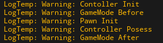

# Controller
Pawn을 조종하기 위한 클래스이다.<br>
플레이어가 입장할 때 배정되며 바꿀 수 없음<br>
입력을 통해 Pawn을 조종하는 PlayerController, AI로직을 통해 Pawn을 조종하는 AIController 등이 있다.<br>
주로 사용하게 될 PlayerController 클래스는 아래와 같이 Player, HUD, Camera를 가지고 있어 입력에의한 Pawn 조작뿐 아니라 UI, 카메라 조작도 가능하다.
```
UPROPERTY()
TObjectPtr<UPlayer> Player;

UPROPERTY()
TObjectPtr<AHUD> MyHUD;

UPROPERTY(BlueprintReadOnly, Category=PlayerController)
TObjectPtr<APlayerCameraManager> PlayerCameraManager;

```
### 게임이 실행되는 순서
1. Controller 생성
3. Pawn 생성
4. PlayerController가 Pawn에 빙의
5. 게임의 시작



게임모드의 PostLogin 에서 pawn이 생성되고 빙의가 진행됨
```
//로그를 추가한 함수들
//GameMode
void AMyGameModeBase::PostLogin(APlayerController* NewPlayer)

//PlayerController
void AMyPlayerController::PostInitializeComponents()
void AMyPlayerController::OnPossess(APawn* pawn)

//Pawn
void AMyPlayer::PostInitializeComponents()
```