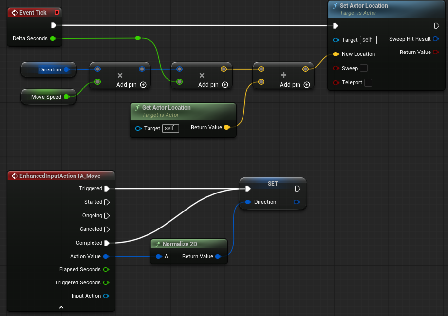

# Enhanced Input System
중요 포인트
- player controller
- input action
- input mapping component

### C++ Enhanced Input

1. 생성자에서 경로를 통해 IMC, IA를 불러와야한다.
2. BeginPlay에서 Controller에 IMC를 매핑한다.
3. SetupPlayerInputComonent 함수를 오버라이드 하여 Input Action과 이벤트함수를 바인딩한다.

```
//생성자
static ConstructorHelpers::FObjectFinder<InputMappingContext>MappingContext(TEXT("Game/Input/IMC_MyMappingContext"));
if(MappingContext.Succeeded())
{
    DefaultIMC = MappingContext.Object;
}

//BeginPlay
if(APlayerController* PlayerController = Cast<APlayerController>(GetController()))
{
    if(UEnhancedInputLocalPlayerSubsystem* SubSystem =
        ULocalPlayer::GetSubsystem<UEnhancedInputLocalPlayerSubsystem>(PlayerController->GetLocalPlayer()))
    {
        SubSystem->AddMappingContext(DefaultIMC, 0); // 0은 우선순위
    }
}

//SetupPlayerInputComponent
if (UEnhancedInputComponent * EnhancedInputComponent = Cast<UEnhancedInputComponent>(PlayerInputComponent))
{
    //InputAction, TriggerEvent, TargetObject ,EventFunction
    EnhancedInputComponent->BindAction(MoveAction, ETriggerEvent::Triggered, this, AMyPlayer::SetDirection);
}
```


# 이동

현재 위치에 방향(단위 벡터) * 속도 의 값을 더해 구현한다.
```
void MyPawn::Move()
{
    FVector newLocation = direction * moveSpeed * deltaTime + GetActorLocation();
    SetActorLocation(newLocation);
}
```

참고) Actor의 SetActorLocation 함수
```
bool AActor::SetActorLocation(const FVector& NewLocation, bool bSweep, FHitResult* OutSweepHitResult, ETeleportType Teleport)
{
    if (RootComponent)
    {
        const FVector Delta = NewLocation - GetActorLocation();
        return RootComponent->MoveComponent(Delta, GetActorQuat(), bSweep, OutSweepHitResult, MOVECOMP_NoFlags, Teleport);
    }
    else if (OutSweepHitResult)
    {
        *OutSweepHitResult = FHitResult();
    }

    return false;
}
```

