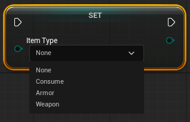

```
UENUM(BlueprintType)
enum class EItemType : int8
{
    None UMETA(DisplayName = "None"),
	Consume UMETA(DisplayName ="Consume"),
	Armor UMETA(DisplayName ="Armor"),
	Weapon UMETA(DisplayName ="Weapon")
}
```
