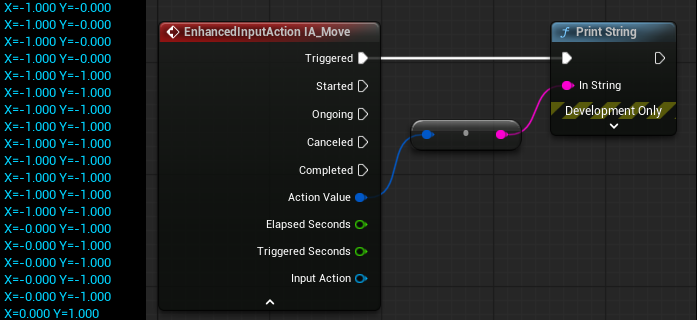
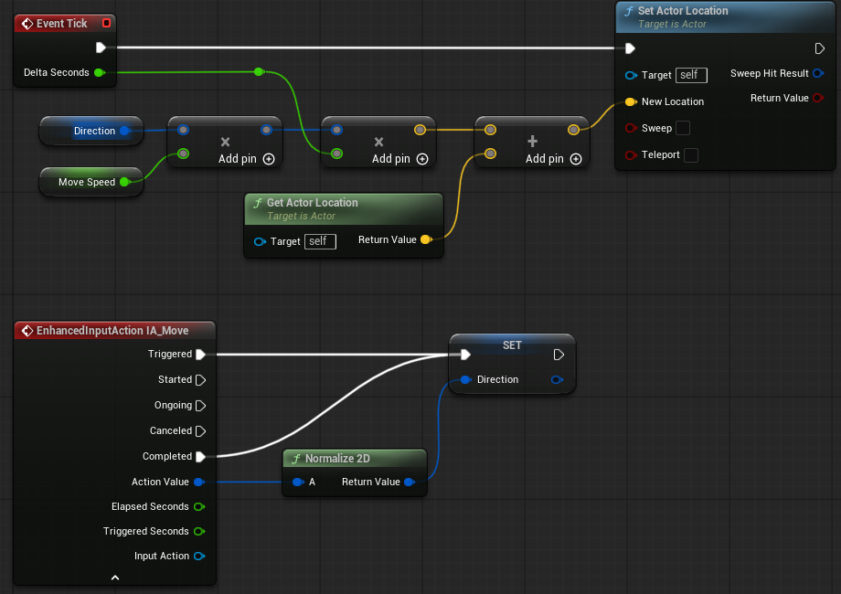
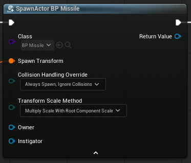
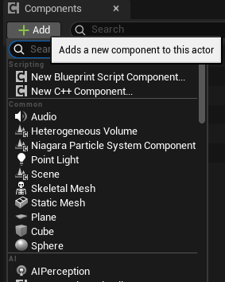

# Unreal_BP

    블루프린트를 이용한 언리얼학습

# Actor / Pawn / Character

|클래스|설명|
|-|-|
|Actor|- 레벨(월드)에 배치되거나 스폰될 수 있는 오브젝트의 기본 클래스<br>- ActorComponent의 컬렉션을 가질 수 있으며, 이를 통해 Actor가 어떻게 움직이는지, 렌더링되는지 등을 제어할 수 있다.|
|Pawn|AI, Player를 조종하는 오브젝트로 Controller를 사용한다.|
|Character|사람형 캐릭터 구현을 위한 Pawn으로 기본적인 Colider, Mesh, Movement를 포함하므로 점프 이동 중력 충돌등을 따로 구현하지 않아도 된다.|

# Controller
Pawn을 조종하기 위한 클래스이다.

입력을 통해 Pawn을 조종하는 PlayerController, AI로직을 통해 Pawn을 조종하는 AIController 등이 있다.

주로 사용하게 될 PlayerController 클래스는 아래와 같이 Player, HUD, Camera를 가지고 있어 입력에의한 Pawn 조작뿐 아니라 UI, 카메라 조작도 가능하다.
```
UPROPERTY()
TObjectPtr<UPlayer> Player;

UPROPERTY()
TObjectPtr<AHUD> MyHUD;

UPROPERTY(BlueprintReadOnly, Category=PlayerController)
TObjectPtr<APlayerCameraManager> PlayerCameraManager;
```
# Enhanced Input System
중요 포인트
- player controller
- input action
- input mapping component




# 이동

현재 위치에 방향(단위 벡터) * 속도 의 값을 더해 구현한다.
```
void MyPawn::Move()
{
	FVector newLocation = direction * moveSpeed * deltaTime + GetActorLocation();
	SetActorLocation(newLocation);
}
```

참고) Actor의 SetActorLocation 함수
```
bool AActor::SetActorLocation(const FVector& NewLocation, bool bSweep, FHitResult* OutSweepHitResult, ETeleportType Teleport)
{
	if (RootComponent)
	{
		const FVector Delta = NewLocation - GetActorLocation();
		return RootComponent->MoveComponent(Delta, GetActorQuat(), bSweep, OutSweepHitResult, MOVECOMP_NoFlags, Teleport);
	}
	else if (OutSweepHitResult)
	{
		*OutSweepHitResult = FHitResult();
	}

	return false;
}
```


# 생성

Actor를 생성하기 위해서는 World에서 SpawnActor 함수를 사용해야 한다.

```
/* SpawnActor 함수
 * Spawn Actors with given transform and SpawnParameters
 * 
 * @param	Class					Class to Spawn
 * @param	Location				Location To Spawn
 * @param	Rotation				Rotation To Spawn
 * @param	SpawnParameters			Spawn Parameters
 *
 * @return	Actor that just spawned
*/

GetWorld()->SpawnActor( ... );
```

BluePrint에서는 SpawnActor BP class 를통해 생성하며 생성할 클래스와 위치 등을 설정할 수 있다.



SpawnActorBP 에서 "Collision Handling Override" 항목은 생성위치에 다른 액터가 존재할 경우 충돌하게될 경우의 처리방식이다.
|선택 항목|설명|
|-|-|
|Always Spawn, Ignore Colisions|충돌 여부와 관계없이 무조건 생성|
|Try To Adjust Location, But Always Spawn|근처에 충돌하지 않을 수 있는 부분을 찾아 생성한다.<br>(찾지 못할 경우 기본 위치에서 생성)|
|Try To Adjust Location, Don't Spawn If Still Colliding|근처에 충돌하지 않을 수 있는 부분을 찾아 생성한다.<br>(찾지 못하면 액터를 생성하지 않는다.)|
|Do Not Spawn|다른 액터와 충돌시 무조건 생성하지 않는다.|

# 컴포넌트

- 언리얼 엔진에서 컴포넌트는 액터가 자신에 서브 오브젝트로 추가할 수 있는 오브젝트이다.

|컴포넌트|기능|
|-|-|
|액터 컴포넌트|- 모든 컴포넌트의 베이스 클래스<br>- 움직임, 인벤토리, 어트리뷰트 관리 및 기타 비물리적 개념과 같은 추상적 동작에 유용<br>- 트랜스폼이 없다.|
|씬 컴포넌트|- 지오메트리(3D 데이터) 표현이 필요하지 않은 위치 기반 동작을 지원한다.<br>- 스프링 암, 카메라, 물리, 오디오도 포함된다.|
|프리미티브 컴포넌트|- 지오메트리 표현을 포함한 씬 컴포넌트<br>- 비주얼 렌더링, 충돌 오버랩 등에 사용됨<br>- 각종 콜리전 볼륨 및 스태틱 메시, 스켈레탈 메시, 스프라이트, 빌보드, 파티클 시스템도 포함된다.|
<br>
```
//C++ 코드를 통한 컴포넌트 추가
//생성자에서 Root, Arrow 컴포넌트를 추가하는 코드

//AMyPawn.h
UPROPERTY(VisibleAnywhere, Category = "Components")
UArrowComponent* Arrow;

//AMyPawn.cpp
AMyPawn::AMyPawn()
{
	//RootComponent는 Actor의 기본 컴포넌트이다.
	RootComponent = CreateDefaultSubobject<USceneComponent>(TEXT("Root"));

	Arrow = CreateDefaultSubobject<UArrowComponent>(TEXT("Arrow"));
	Arrow->SetupAttachment(RootComponent);
}
```
블루프린트에서 컴포넌트를 추가

