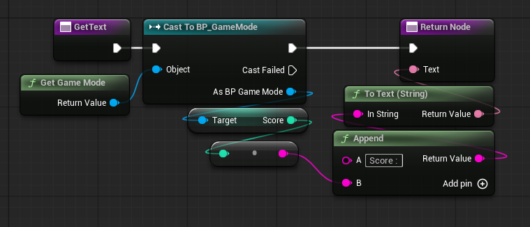
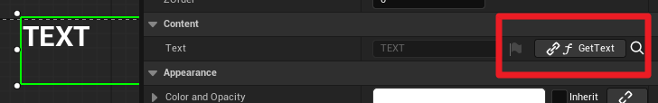
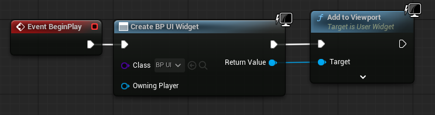

# Unreal_BP

    블루프린트를 이용한 언리얼학습

# Unreal에서 권장하는 코딩표준

### 클래스 명명규칙
각 단어의 첫 번째 글자를 대문자로 사용<br>클래스 종류에 따른 접두사 설정<br>
|접두사|클래스|
|-|-|
|T|템플릿 클래스|
|U|UObject를 상속|
|A|AActor를 상속|
|S|SWidget를 상속|
|I|Interface|
|C|Concept|
|E|Enum|
|b|bool|
|F|그 외 대부분|

### nullptr
```NULL``` 대신 ```nullptr``` 사용<br>

### auto
몇 가지 상황을 제외하고 ```auto```를 사용하지 말것<br>
초기화 하려는 타입은 항상 명시해야 한다.

auto를 사용 가능한 경우
- 변수에 람다를 바인딩해야 하는 경우.
- Iterator (반복자) 변수의 경우.
- template 코드에서 타입을 쉽게 식별할 수 없는 경우

### captures 와 반환타입

# Property
- 프로퍼티 선언시 아래와 같이 사용
```
UPROPERTY( A, B, ... , key = value)
Type Var;
```
 
 ### 자주 쓰이는 프로퍼티<br>([프로퍼티 지정자](https://dev.epicgames.com/documentation/en-us/unreal-engine/unreal-engine-uproperties#propertyspecifiers))
  ```EditAnywhere``` : 에디터 패널에서 편집 가능
  <br>```BlueprintReadWrite``` : 블루프린트에서 읽기/쓰기 가능
  <br>```VisibleAnywhere``` : 에디터에서 값을 볼 수 있되 편집 불가능
  <br>```BlueprintReadOnly``` : 블루프린트에서 읽기 가능
  <br>```EditDefaultsOnly``` : 클래스 __디폴트값__ 에서만 편집 가능
  <br>```Category = "Category"``` : 디테일 패널에서 그룹화

# 문자열
문자열 인코딩에는 `TEXT()` 매크로를 사용
|클래스|개요|
|-|-|
|```FName```|- 데이터 테이블에 한 번만 저장된다.<br>- 대소문자를 구별하지 않는다.<br>- 변경할 수 없다.|
|```FText```|- 텍스트 현지화 지원을 위한 주요 컴포넌트.<br>- 외부 API를 인터페이스에 표시하는 작업 등에 유용.|
|```FString```|- 조작 가능한 유일한 스트링 클래스.<br>- 검색, 변경, 비교 가능하지만 그만큼 무겁다.|
### [문자열 클래스변환](https://dev.epicgames.com/documentation/en-us/unreal-engine/string-handling-in-unreal-engine#conversions)

### FName
생성 <br>```FName TestName = FName(TEXT("TestFName"));```<br><br>
변환 From FName<br>```TestString = TestName.ToString();```<br>```TestText = FText::FromName(TestName);```<br><br>
변환 To FName<br>```TestName = FName(*TestString);```<br>```FText -> FString -> FName```<br><br>
비교<br>`==` 연산자 사용 -> true/false<br>`TestName.Compare(OtherName);` 함수 사용 -> -1 / 0 / 1

### FText
텍스트 포맷, 숫자 및 시간 텍스트 생성 등에 유용<br>
```FText::GetEmpty()``` ```FText()```를 통해 빈 FText를 만들 수 있음<br>

변환<br>
```AsCultureInvariant``` : 현지화되지 않는 FText인스턴스 생성<br>
```FormString``` : 기존 FString 에서 FText 인스턴스 생성<br>
```FromName``` : 기존 FName에서 FText 인스턴스 생성, FName.ToString() 출력에서 FromString 을 호출하는것과 같음

비교<br>
```EqualTo``` : true/false<br>
```CompareTo``` : -1 / 0 / 1<br>


# Log
```
UE_LOG(LogCategory, LogLevel, Context);
```

# ConstructorHelper

주로 객체 생성자에서 사용되는 구조체<br>
FClassFinder, FObjctFinderOptional
```
static ConstructorHelpers::FObjectFinder<ObjName>OutObject(TEXT(" 경 로 "));

if(OutObject.Succeeded()) //불러왔을 경우
{

}

```

# Actor / Pawn / Character
|클래스|설명|
|-|-|
|Actor|- 레벨(월드)에 배치되거나 스폰될 수 있는 오브젝트의 기본 클래스<br>- ActorComponent의 컬렉션을 가질 수 있으며, 이를 통해 Actor가 어떻게 움직이는지, 렌더링되는지 등을 제어할 수 있다.|
|Pawn|AI, Player를 조종하는 오브젝트로 Controller를 사용한다.|
|Character|사람형 캐릭터 구현을 위한 Pawn으로 기본적인 Colider, Mesh, Movement를 포함하므로 점프 이동 중력 충돌등을 따로 구현하지 않아도 된다.|

# Controller
Pawn을 조종하기 위한 클래스이다.<br>
플레이어가 입장할 때 배정되며 바꿀 수 없음<br>
입력을 통해 Pawn을 조종하는 PlayerController, AI로직을 통해 Pawn을 조종하는 AIController 등이 있다.<br>
주로 사용하게 될 PlayerController 클래스는 아래와 같이 Player, HUD, Camera를 가지고 있어 입력에의한 Pawn 조작뿐 아니라 UI, 카메라 조작도 가능하다.
```
UPROPERTY()
TObjectPtr<UPlayer> Player;

UPROPERTY()
TObjectPtr<AHUD> MyHUD;

UPROPERTY(BlueprintReadOnly, Category=PlayerController)
TObjectPtr<APlayerCameraManager> PlayerCameraManager;
```
### 게임이 실행되는 순서
1. Controller 생성
3. Pawn 생성
4. PlayerController가 Pawn에 빙의
5. 게임의 시작


게임모드의 PostLogin 에서 pawn이 생성되고 빙의가 진행됨
```
//로그를 추가한 함수들
//GameMode
void AMyGameModeBase::PostLogin(APlayerController* NewPlayer)

//PlayerController
void AMyPlayerController::PostInitializeComponents()
void AMyPlayerController::OnPossess(APawn* pawn)

//Pawn
void AMyPlayer::PostInitializeComponents()
```

# Enhanced Input System
중요 포인트
- player controller
- input action
- input mapping component

### C++ Enhanced Input

1. 생성자에서 경로를 통해 IMC, IA를 불러와야한다.
2. BeginPlay에서 Controller에 IMC를 매핑한다.
3. SetupPlayerInputComonent 함수를 오버라이드 하여 Input Action과 이벤트함수를 바인딩한다.

```
//생성자
static ConstructorHelpers::FObjectFinder<InputMappingContext>MappingContext(TEXT("Game/Input/IMC_MyMappingContext"));
if(MappingContext.Succeeded())
{
	DefaultIMC = MappingContext.Object;
}

//BeginPlay
if(APlayerController* PlayerController = Cast<APlayerController>(GetController()))
{
	if(UEnhancedInputLocalPlayerSubsystem* SubSystem =
		ULocalPlayer::GetSubsystem<UEnhancedInputLocalPlayerSubsystem>(PlayerController->GetLocalPlayer()))
	{
		SubSystem->AddMappingContext(DefaultIMC, 0); // 0은 우선순위
	}
}

//SetupPlayerInputComponent
if (UEnhancedInputComponent * EnhancedInputComponent = Cast<UEnhancedInputComponent>(PlayerInputComponent))
{
	//InputAction, TriggerEvent, TargetObject ,EventFunction
	EnhancedInputComponent->BindAction(MoveAction, ETriggerEvent::Triggered, this, AMyPlayer::SetDirection);
}
```


# 이동

현재 위치에 방향(단위 벡터) * 속도 의 값을 더해 구현한다.
```
void MyPawn::Move()
{
	FVector newLocation = direction * moveSpeed * deltaTime + GetActorLocation();
	SetActorLocation(newLocation);
}
```

참고) Actor의 SetActorLocation 함수
```
bool AActor::SetActorLocation(const FVector& NewLocation, bool bSweep, FHitResult* OutSweepHitResult, ETeleportType Teleport)
{
	if (RootComponent)
	{
		const FVector Delta = NewLocation - GetActorLocation();
		return RootComponent->MoveComponent(Delta, GetActorQuat(), bSweep, OutSweepHitResult, MOVECOMP_NoFlags, Teleport);
	}
	else if (OutSweepHitResult)
	{
		*OutSweepHitResult = FHitResult();
	}

	return false;
}
```


# 생성

Actor를 생성하기 위해서는 World에서 SpawnActor 함수를 사용해야 한다.

```
/* SpawnActor 함수
 * Spawn Actors with given transform and SpawnParameters
 * 
 * @param	Class					Class to Spawn
 * @param	Location				Location To Spawn
 * @param	Rotation				Rotation To Spawn
 * @param	SpawnParameters			Spawn Parameters
 *
 * @return	Actor that just spawned
*/

GetWorld()->SpawnActor( ... );
```

BluePrint에서는 SpawnActor BP class 를통해 생성하며 생성할 클래스와 위치 등을 설정할 수 있다.


SpawnActorBP 에서 "Collision Handling Override" 항목은 생성위치에 다른 액터가 존재할 경우 충돌하게될 경우의 처리방식이다.
|선택 항목|설명|
|-|-|
|Always Spawn, Ignore Colisions|충돌 여부와 관계없이 무조건 생성|
|Try To Adjust Location, But Always Spawn|근처에 충돌하지 않을 수 있는 부분을 찾아 생성한다.<br>(찾지 못할 경우 기본 위치에서 생성)|
|Try To Adjust Location, Don't Spawn If Still Colliding|근처에 충돌하지 않을 수 있는 부분을 찾아 생성한다.<br>(찾지 못하면 액터를 생성하지 않는다.)|
|Do Not Spawn|다른 액터와 충돌시 무조건 생성하지 않는다.|

# 컴포넌트

- 언리얼 엔진에서 컴포넌트는 액터가 자신에 서브 오브젝트로 추가할 수 있는 오브젝트이다.

|컴포넌트|기능|
|-|-|
|액터 컴포넌트|- 모든 컴포넌트의 베이스 클래스<br>- 움직임, 인벤토리, 어트리뷰트 관리 및 기타 비물리적 개념과 같은 추상적 동작에 유용<br>- 트랜스폼이 없다.|
|씬 컴포넌트|- 지오메트리(3D 데이터) 표현이 필요하지 않은 위치 기반 동작을 지원한다.<br>- 스프링 암, 카메라, 물리, 오디오도 포함된다.|
|프리미티브 컴포넌트|- 지오메트리 표현을 포함한 씬 컴포넌트<br>- 비주얼 렌더링, 충돌 오버랩 등에 사용됨<br>- 각종 콜리전 볼륨 및 스태틱 메시, 스켈레탈 메시, 스프라이트, 빌보드, 파티클 시스템도 포함된다.|

```
//C++ 코드를 통한 컴포넌트 추가
//생성자에서 Root, Arrow 컴포넌트를 추가하는 코드

//AMyPawn.h
UPROPERTY(VisibleAnywhere, Category = "Components")
UArrowComponent* Arrow;

//AMyPawn.cpp
AMyPawn::AMyPawn()
{
	//RootComponent는 Actor클래스에 포함된 컴포넌트이다.
	RootComponent = CreateDefaultSubobject<USceneComponent>(TEXT("Root"));

	Arrow = CreateDefaultSubobject<UArrowComponent>(TEXT("Arrow"));
	Arrow->SetupAttachment(RootComponent); //생성자에서 루트컴포넌트에 다는 함수
}
```
블루프린트에서 컴포넌트를 추가


# Array를 이용한 랜덤위치 스폰

Variables에 Component를 변수로 저장할 수 있으며, 배열로 여러개를 저장할 수 있다.

```
//헤더에 선언된 배열
TArray<UArrowComponent> Arrows;

//ASpawner.cpp
ASpawner::ASpawner()
{
	PrimaryActorTick.bCanEverTick = true;

	//루트 생성
	RootComponent = CreateDefaultSubobject<USceneComponent>(TEXT("Root"));
	CurrentDelay = 2.0f;

	// 화살표 생성
	for (size_t i = 0; i < 5; i++)
	{
		FString str = "Arrow" + FString::FromInt(i);
		UArrowComponent* Arrow = CreateDefaultSubobject<UArrowComponent>(FName(str));

		//위치, 회전 설정
		double y = 100.0 - 50.0 * i;
		Arrow->SetRelativeLocation(FVector(0, y, 0));
		Arrow->SetRelativeRotation(FQuat::MakeFromEuler(FVector(0, 0, 180)));
		Arrow->SetupAttachment(RootComponent);

		//TArray에 추가
		Arrows.Add(Arrow);
	}

	//스폰 파라미터 오너설정, 충돌무시
	SpawnParams.Owner = this;
	SpawnParams.SpawnCollisionHandlingOverride = ESpawnActorCollisionHandlingMethod::AdjustIfPossibleButAlwaysSpawn;
}

//매틱 시간차를 구해 0.5초마다 새로운 적을 생성한다.
void ASpawner::Tick(float DeltaTime)
{
	Super::Tick(DeltaTime);
	CurrentDelay -= DeltaTime;
	
	if (CurrentDelay <= 0)
	{
		int randomIndex = FMath::RandRange(0, Arrows.Num()-1);
		AEnemy* newEnemy = GetWorld()->SpawnActor<AEnemy>(AEnemy::StaticClass(), Arrows[randomIndex]->GetRelativeTransform());

		CurrentDelay = 0.5f;
	}
}

```
### View


---

블루프린트


결과


# Collision

- 액터들간의 충돌을 발생시키는 영역이다.
- Box, Capsule, Sphere 총 세 가지 기본형태가 존재한다.
- 프로젝트 설정에서 아래와 같이 추가할 수 있으며 충돌에 대한 세 가지 반응이 존재한다.


|반응|설명|
|-|-|
|Ignore|부딪혀도 충돌했다는 이벤트를 무시|
|Overlap|충돌 이벤트 발생, 물리적으로는 무시|
|Block|출돌 이벤트 발생, 물리적으로 밀어냄|

서로 다른 반응을 가진 오브젝트끼리의 충돌에서는 처리가 더 적은 응답으로 충돌 처리가 발생한다.<br>
Ignore > Overlap > Block 의 우선 순위를 가지며 예를 들어 Ignore와 Overlap 혹은 Block가 부딛힐 경우 Ignore로 적용된다.<br>
Collision의 설정으로 [Collision Enabled](https://dev.epicgames.com/documentation/en-us/unreal-engine/python-api/class/CollisionEnabled?application_version=5.2) 항목이 있는데 이는 감지 기능이나 물리 작용을 켜거나 끌 수 있게 해준다.

|종류|설명|
|-|-|
|No Collision|감지와 물리 작용 모두 사용하지 않음|
|Query Only|감지(Overlap) 기능만 동작함|
|Physics Only|물리(Physics) 작용 기능만 동작함|
|Collision Enabled|감지와 물리 모두 동작함|
|Probe Only|충돌에 물리적으로 반응하지 않지만 잠재적으로 물리 상호작용을 감지하고 충돌 데이터를 전달한다.|
|Query and Probe|충돌에 물리적으로 반응하지 않지만 잠재적으로 공간(레이캐스트)와 물리 모두 감지한다.|


## C++
```
// Actor.h 에서 충돌이벤트
	/** 
	 *	Event when this actor overlaps another actor, for example a player walking into a trigger.
	 *	For events when objects have a blocking collision, for example a player hitting a wall, see 'Hit' events.
	 *	@note Components on both this and the other Actor must have bGenerateOverlapEvents set to true to generate overlap events.
	 */
	UFUNCTION(BlueprintImplementableEvent, meta=(DisplayName = "ActorBeginOverlap"), Category="Collision")
	ENGINE_API void ReceiveActorBeginOverlap(AActor* OtherActor);

//Enemy.cpp
	AEnemy::AEnemy()
	{
	
		PrimaryActorTick.bCanEverTick = true;

		//박스 루트로 컴포넌트 추가
		box = CreateDefaultSubobject<UBoxComponent>(TEXT("Box"));

		RootComponent = box;
		box->InitBoxExtent(FVector(50.0f, 50.0f, 50.0f));
		//프리셋 설정
		box->SetCollisionProfileName(TEXT("Enemy"));

		//외관설정
		BoxVisual = CreateDefaultSubobject<UStaticMeshComponent>(TEXT("VIsualMesh"));
		BoxVisual->SetupAttachment(RootComponent);
		static ConstructorHelpers::FObjectFinder<UStaticMesh> CubeAsset(TEXT("/Engine/BasicShapes/Cube.Cube"));
		if (CubeAsset.Succeeded())
		{
			BoxVisual->SetStaticMesh(CubeAsset.Object);
			BoxVisual->SetWorldScale3D(FVector(0.8f));
		}
	}

	void AEnemy::BeginPlay()
	{
		Super::BeginPlay();
		//충돌시 호출할 함수를 연결
		box->OnComponentBeginOverlap.AddDynamic(this, &AEnemy::OnOverlapBegin);
	}

	//충돌시 호출되는 함수
	void AEnemy::OnOverlapBegin(UPrimitiveComponent* OverlappedComp, AActor* OtherActor, UPrimitiveComponent* OtherComp, int32 OtherBodyIndex, bool 	bFromSweep, const FHitResult& SweepResult)
	{
		AMyPlayer* other = Cast<AMyPlayer>(OtherActor);
		if ( other )
		{
			other->GetDamage(1.0f);
		}
	}
```


## Blueprint
블루프린트는 매우 단순하다.<br> Event ActorBeginOverlap을 통해 캐스트를 성공할 경우 해당 클래스에 맞는 처리를 하면 된다.


# UMG(Unreal Motion Graphics) UI

## Widget
Widget은 게임월드 내에서 상호작용하는 컴포넌트이다.<br>
언리얼에서 UI를 출력 하기 위해서는 "Create HUD Widget"함수를 통해 Widget을 생성하고 "Add to Viewport"함수를 통해 Viewport에 연결을 해야한다.

SetInputMode, Show Cursor를 통해 사용자와 UI를 통한 상호작용을 할 수 있다.

위젯의 하위 객체로 다른 위젯을 추가해 중첩시키는 것도 가능하다.

## BluePrint

UI Widget Blueprint<br>


TextWidget<br>


GameModeBase<br>


